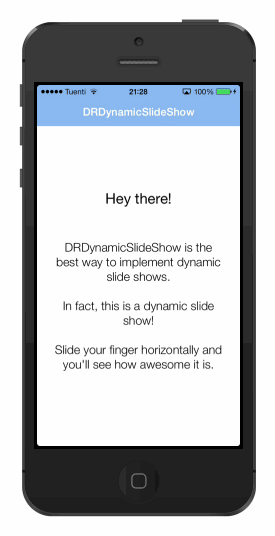

DRDynamicSlideShow
==================

A UIScrollView subclass to easily implement an amazing swiping interactive slide show, as IFTTT's.

->  <-

No external frameworks or subclasses for subviews needed. Just add a `DRDynamicSlideShow` to your view, and add `DRDynamicSlideShowAnimation`'s to it to let the magic happen.

## How to use

Here's an super simple example of how to use `DRDynamicSlideShow`. You can check out the **example app**, too.

1. First, add a `DRDynamicSlideShow` instance to your view.

2. Then, you can use the following method to **add subviews** to it on the page you want (you can simply use `addSubview:` as well):

		[dynamicSlideShow addSubview:coolSubview onPage:0];
	
3. Finally, you just need to **add whatever animation you want** it to perform for those subviews when the specified page is being swiped.

		[self.slideShow addAnimation:[DRDynamicSlideShowAnimation animationForSubview:coolSubview page:0 keyPath:@"alpha" toValue:@0 delay:0]];
	
	or

		[self.slideShow addAnimation:[DRDynamicSlideShowAnimation animationForSubview:coolSubview page:0 keyPath:@"alpha" fromValue:@0 toValue:@1 delay:0]];

Notice there are two ways for instantiating `DRDynamicSlideShowAnimation`. If you want the subview to animate **from its current value**, just use `animationForSubview:page:keyPath:toValue:delay:`. Else, use `animationForSubview:page:keyPath:fromValue:toValue:delay:`.

As you can see, all we need for adding each animation is actually **1 line of code**. Pretty amazing, isn't it? :)

## Known issues

- The animation used to go to next page by tapping the view does not consider `DRDynamicSlideShowAnimation`'s `delay` property.

## LICENSE

You can use it for whatever you want, however you want. I just would love to know if you're using it in any project of yours.