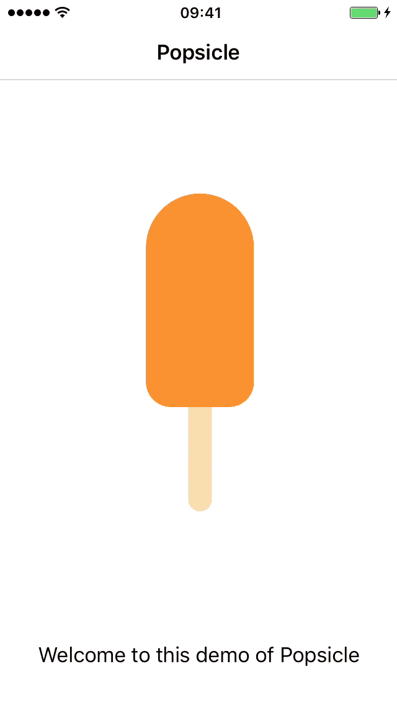

<p align="center">
	
</p>

Popsicle is an easy-as-pie approach to creating and managing interpolations of different value types, as well as implementing your own custom value interpolations.

<p align="center">
	
</p>

_Note: this framework comes out as an abstraction of former `DRDynamicSlideShow`'s keyframing logic. You can combine this framework with components such as [__`DRPageScrollView`__](https://github.com/Dromaguirre/DRPageScrollView) or vanilla `UIScrollView` and still get the same functionality provided by `DRDynamicSlideShow`._

## Installation

#### Carthage

	github "Dromaguirre/Popsicle"

#### CocoaPods

	pod 'Popsicle'

#### Manual

Drag and copy all files in the [__Popsicle__](Popsicle) folder into your project.

## At a glance

#### Interpolating UIView values

`Popsicle` is basically divided in two classes: `PSInterpolator` and `PSInterpolation`.

First, you need a retained instance of `PSInterpolator`, which is as simple as declaring it as a property or ivar (commonly in your view controller) and initializing it like this:

```objective-c
interpolator = [PSInterpolator new];
```

_Note: `interpolator` has a `time` property. Every `PSInterpolation` instance you add to that `PSInterpolator` instance will depend on that property to determine its current value. `time` is an abstract concept here, and has nothing to do with literal time. You may define `time` however you want. For example, `time` may be the position of a finger on the screen from 0 to 240, determined by a `UIPanGestureRecognizer`, or the amount of brightness of the screen from 0 to 1, determined by `UIScreen`._

Next, you need to add some `PSInterpolation` instances to your `interpolator`. In the example below, we are going to interpolate the alpha value of a UIView through a `PSFloatInterpolation`, with a `time` range of 0 to 100:

```objective-c
[self.interpolator addInterpolations:PS(PSFloatInterpolation, 0, 100, 1, 0) forObjects:view keyPath:@"alpha"];
```

_Note: for the sake of simplicity, Popsicle provides a great macro to create instances of `PSInterpolation`: `PS(INTERPOLATION_CLASS, START_TIME, END_TIME, FROM_VALUE, TO_VALUE)`. Also note you can specify multiple interpolations for multiple objects at once._

Finally, just make your `interpolator` vary its `time` depending on whatever you want. For example, in case you're using a `UIScrollView`:

```objective-c
- (void)scrollViewDidScroll:(UIScrollView *)scrollView {
	interpolator.time = scrollView.contentOffset.x
	// view.alpha = 1 when scrollView.contentOffset.x = 0
	// view.alpha = 0.75 when scrollView.contentOffset.x = 25
	// view.alpha = 0.5 when scrollView.contentOffset.x = 50
	// ... and so on.
}
```

#### Creating custom value interpolations

You can create your own value interpolations subclassing `PSInterpolation`.

In the example below, you'll see how `PSFloatInterpolation` has been implemented.

```objective-c
// PSFloatInterpolation.h

#import "PSInterpolation.h"

@interface PSFloatInterpolation : PSInterpolation

// This allows `PS()` macro to work correctly.
+ (instancetype)interpolationWithStartTime:(float)startTime endTime:(float)endTime fromValue:(float)fromValue toValue:(float)toValue;

@end
```

```objective-c
// PSFloatInterpolation.h

#import "PSFloatInterpolation.h"
#import "PSInterpolation+Subclass.h" // Notice you need this file for Interpolation() to work.

@implementation PSFloatInterpolation

// Remember fromValue and toValue are objects, so we need to pass in a NSNumber. You may make any necessary value conversions as shown below.
// If this library was written in Swift, this "problem" wouldn't exist, since values like float are already objects in Swift. Give me some time :)
+ (instancetype)interpolationWithStartTime:(float)startTime endTime:(float)endTime fromValue:(float)fromValue toValue:(float)toValue {
	return [super interpolationWithStartTime:startTime endTime:endTime fromValue:@(fromValue) toValue:@(toValue)];
}

// This method is called whenever PSInterpolator performs a new interpolation, so you must return a value here depending on timeFraction (from 0 to 1).
// The easiest way possible is using Interpolation(), already included in PSInterpolation+Subclass.h.
- (id)valueForTimeFraction:(float)timeFraction {
	// Here we retrieve our fromValue and toValue and convert them to float in order to manage them with Interpolation().
	float fromValue = [self.fromValue floatValue];
	float toValue = [self.toValue floatValue];
	
	// Here we interpolate fromValue and toValue depending on the parameter timeFraction in order to get the intermediate value we need to return.
	float value = Interpolation(fromValue, toValue, timeFraction);
	
	// Here we retrieve our fromValue and toValue and convert them to float in order to manage them with Interpolation().
	return @(value);
}

@end
```

## License

Popsicle is available under the MIT license.